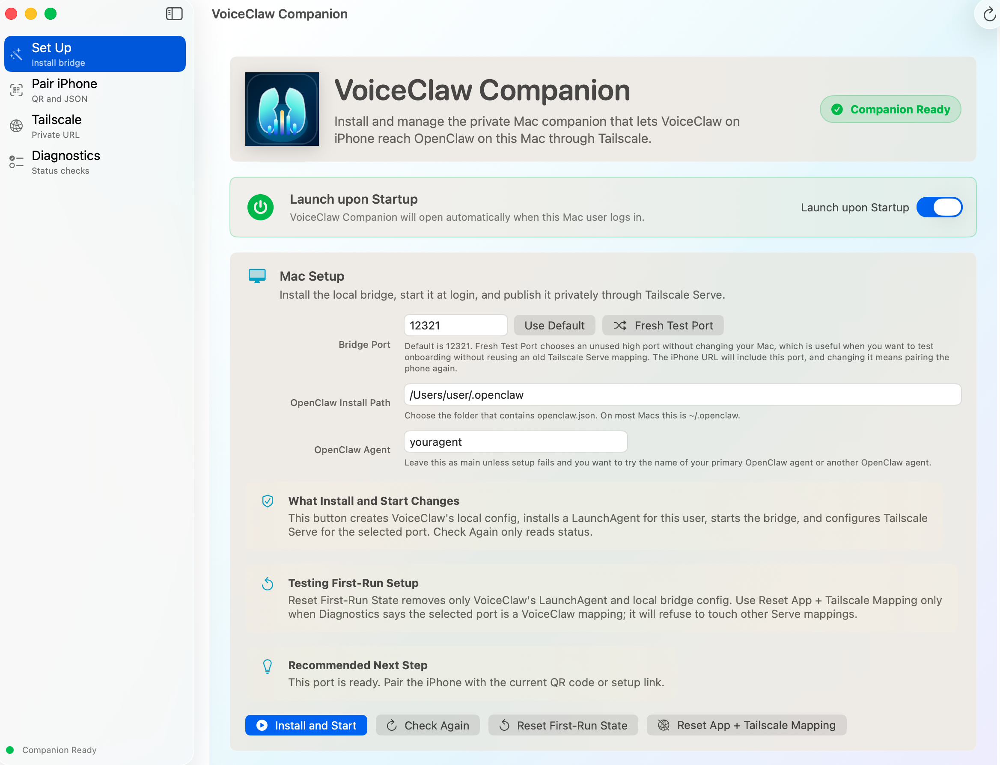
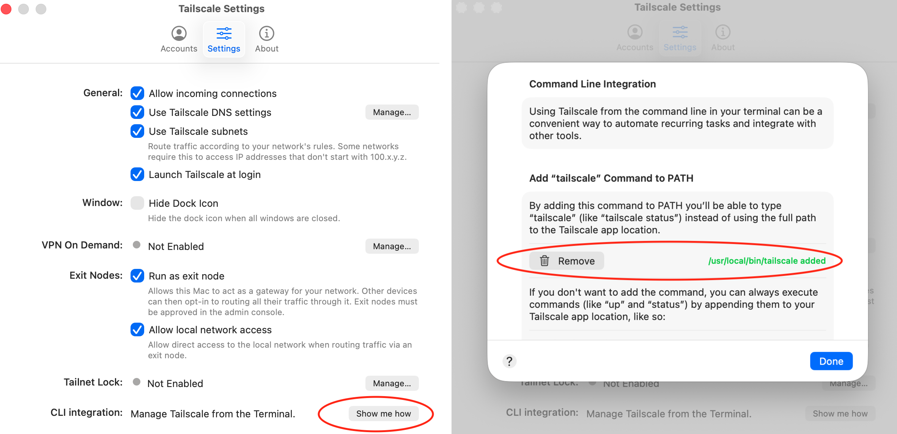

# VoiceClaw Companion

VoiceClaw Companion is the macOS bridge app for VoiceClaw on iPhone and Apple Watch. It connects the mobile app to the user's own OpenClaw installation through their private Tailscale network, without using another person's Mac, tailnet, or API credentials.

## Requirements

- macOS 13 or later.
- Tailscale installed and signed in on the Mac.
- Tailscale HTTPS certificates enabled for the user's tailnet.
- Node.js installed on the Mac.
- OpenClaw installed on the Mac. The install path should be the folder that contains `openclaw.json`, usually `~/.openclaw`.
- VoiceClaw installed on iPhone from TestFlight.

## Documentation

- [Companion feature inventory](docs/COMPANION_FEATURE_INVENTORY.md)

## Install

Download the latest DMG from GitHub Releases, open it, and drag **VoiceClaw Companion** into Applications. After the first install, the app can update itself from signed GitHub Release builds through Sparkle, so users do not have to manually download each new DMG.

Open the app and click **Install and Start**. The companion will:

- create `~/.voiceclaw/bridge.json`;
- generate a private pairing token;
- install `~/Library/LaunchAgents/ai.voiceclaw.bridge.plist`;
- publish the local bridge through Tailscale Serve;
- show a QR code and setup JSON for pairing the iPhone.

Tailscale Serve is Tailscale's private HTTPS reverse proxy. It forwards a private Tailscale URL on the Mac to the local VoiceClaw bridge service. The default bridge port is `12321`; users should change it only if the port is already in use or they intentionally want a separate test bridge. **Fresh Test Port** chooses an unused high port without changing the Mac; the user still has to click **Install and Start** before anything is installed or published.

The Pair iPhone screen includes an OpenAI API key field. **Include API Key in Setup QR** is on by default, so the QR code/setup JSON can put the user's own GPT-Realtime-2 key into the iPhone Keychain during pairing. Turn it off only when you want to enter the key manually on iPhone.

## Troubleshooting

1. If VoiceClaw Realtime on your phone does not connect after completing QR code settings sync, make sure Tailscale command line integration is installed on the Mac. Open **Tailscale** > **Settings** > **Command Line Integration** > **Show me how**, choose **Add `"tailscale"` command to PATH**, then rerun **Install and Start** in VoiceClaw Companion.

## Updates

VoiceClaw Companion checks GitHub Releases for signed updates. Automatic checks and automatic signed update installs are on by default. The Diagnostics screen lets users choose whether checks run every 5 minutes, every 30 minutes, or every hour. The main window and menu bar item show prominently when a newer build is available.

## Reset First-Run State

The companion includes **Reset First-Run State** for testing onboarding. It removes only VoiceClaw's LaunchAgent and local bridge config:

- `~/Library/LaunchAgents/ai.voiceclaw.bridge.plist`
- `~/.voiceclaw/bridge.json`

It does not uninstall Tailscale, change tailnet settings, remove OpenClaw, remove Node.js, or delete iPhone settings.

For a cleaner onboarding test, **Reset App + Tailscale Mapping** can also remove the selected Tailscale Serve mapping. This action is intentionally guarded: it runs only when diagnostics identify the selected port as a VoiceClaw mapping that forwards exactly to `http://127.0.0.1:<port>`. It refuses to remove other Serve mappings, and it never runs Tailscale's full `serve reset` command.

## Privacy Policy
Neither the iOS/watchOS apps nor the macOS companion apps collect any data at all. Nothing leaves your system. No background "phoning home". Nothing. Feel free to inspect them yourself. The privacy policy is, essentially, "I never touch your data, so I never handle your data, so you privacy is never jeopardized in the first place. I have no idea who you are and I don't care. Enjoy (and please subscribe to the iOS app)!"
